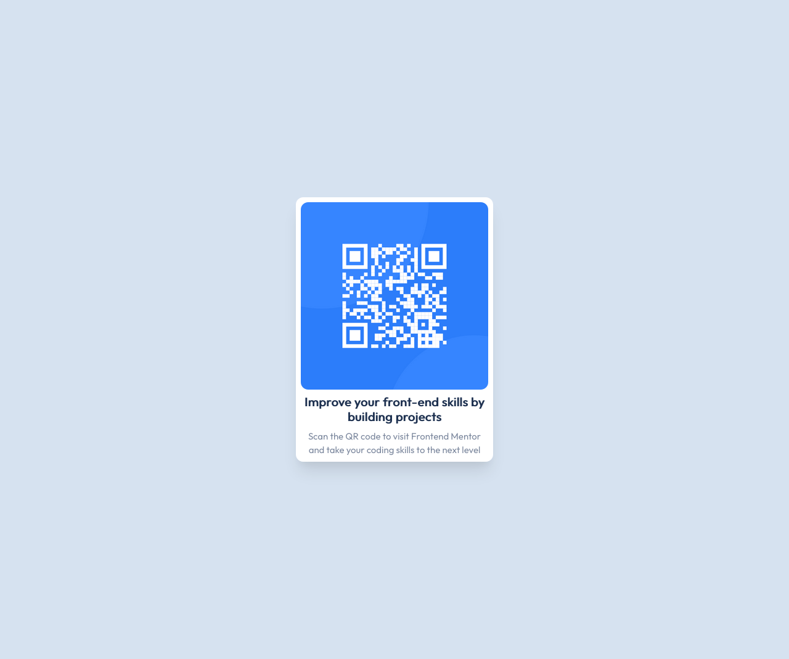

# Frontend Mentor - QR code component solution

This is a solution to the [QR code component challenge on Frontend Mentor](https://www.frontendmentor.io/challenges/qr-code-component-iux_sIO_H). Frontend Mentor challenges help you improve your coding skills by building realistic projects. 

## Table of contents

- [Overview](#overview)
  - [Screenshot](#screenshot)
  - [Links](#links)
- [My process](#my-process)
  - [Built with](#built-with)
  - [What I learned](#what-i-learned)
- [Author](#author)


## Overview

### Screenshot



### Links

- Solution URL: [https://hardcore-fermat-040040.netlify.app](https://hardcore-fermat-040040.netlify.app)

## My process

### Built with

- [React](https://reactjs.org/) - JS library
- [Chakra-UI](https://chakra-ui.com/) - React component library


### What I learned

I learnt how to use a custom theme to style the Chakra UI components for the QR code.

Example(s):

```js
const Heading = {
  baseStyle: {
    fontWeight: "700",
    color: "blue",
    textAlign: 'center'
  }
}

export default Heading;
```
```js
ReactDOM.render(
  <ChakraProvider theme={customTheme}>
    <App />
  </ChakraProvider>,
  document.getElementById('root')
);
```


## Author

- Website - [Dmani](https://www.your-site.com)
- Frontend Mentor - [@Dmani871](https://www.frontendmentor.io/profile/yourusername)

